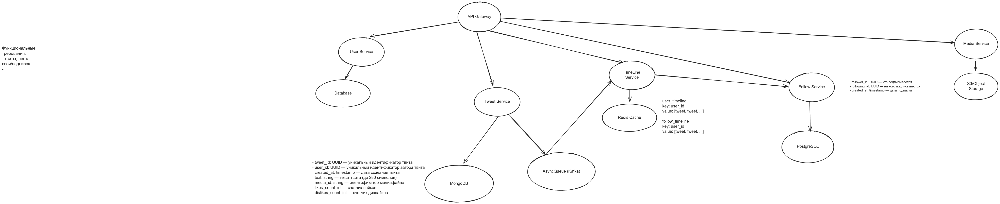

# Full stack mini twitter microservices app

Microservices practice and many new techologis

## Services

- user-service (Python, FastApi, Postgresql, Taskiq, Redis)
- tweet-service (Python, ...)
- timeline-service (Go, ...)
- follow-service (Go, ...)
- ml-service (Python, FastApi, ...)
- media-service (Go, ...)

- gateway
- frontend

## Launch

soon
